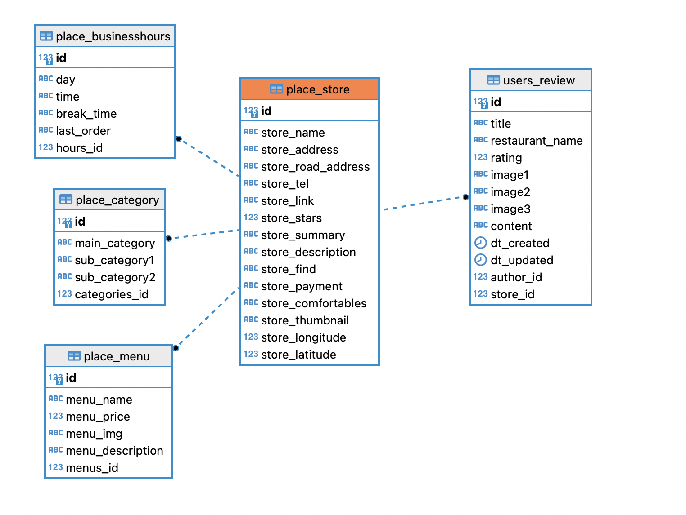

# 맛집 추천 및 리뷰 웹사이트

## 프로젝트 진행 과정

1. 주제선정

    - 구로 디지털 단지 주변 맛집 추천과 리뷰를 볼 수 있는 페이지를 만들자.
    - 구로뿐만 아니라 서울지역으로 확장해보자.

2. 데이터 수집

    - 네이버 플레이스(지도) 음식점 정보 수집
        - 네이버 지역 검색 API - OO구 OO동 맛집 검색
        - 검색 API 결과 기반 네이버 지도 크롤링 (식당 정보, 리뷰, 사진 등)

3. 데이터 베이스 설계

    - 수집 데이터 기반 데이터 베이스 설계

    - RDBMS (PostgreSQL 사용)

    - 테이블 설계

        - place_store : 식당 기본 정보 테이블
        - place_menu : 식당 메뉴 정보 테이블
        - place_category : 식당 분류 정보 테이블
        - place_businesshours : 식당 영업 시간 정보 테이블
        - users_user : 사용자 정보 테이블
        - users_review : 사용자 리뷰 정보 테이블

        

4. django web 개발

    - 디렉토리구조

        ```
        django_web/
        ├── config/
        │   ├── __pycache__
        │   ├── __init__.py
        │   ├── asgi.py
        │   ├── settings.py
        │   └── urls.py
        ├── place/
        │   ├── __paycache__
        │   ├── migrations/
        │   ├── templates/
        │   ├── __init__.py
        │   ├── admin.py
        │   ├── apps.py
        │   ├── models.py
        │   ├── tests.py
        │   ├── urls.py
        │   └── views.py
        ├── users/
        │   ├── __pycache__
        │   ├── migrations/
        │   ├── templates/
        │   ├── management/
        │   ├── __init__.py
        │   ├── admin.py
        │   ├── forms.py
        │   ├── functions.py
        │   ├── middleware.py
        │   ├── models.py
        │   ├── tests.py
        │   ├── validators.py
        │   └── views.py
        ├── static/
        │   ├── admin/
        │   ├── place/
        │   └── users/
        ├── media/
        │   └── images/
        └── manage.py
        ```


## 기능상세

추가예정


## 느낀점과 개선사항

### 1. 데이터 수집

데이터 수집부터 웹 기능 구현까지 모두 경험해본 것 같다.

네이버 검색 API에 요청해서 데이터를 받았는데 필요한 데이터가 턱없이 부족해서 크롤링 코드를 짰다.

처음에 수집과정에서 크롤링 코드를 짤 때 모든 데이터를 json파일로 만들어서 저장하는 형태로 코드를 만들었다.

일단 저장하고 나중에 불러서 전처리하면 되겠지 하는 생각으로 데이터를 수집하니 전처리 과정에서 매우 힘들었다.

시간도 오래걸리고 생각할 것도 많아서 고생을 많이 했다. 처음에 데이터를 수집할 때 어떤 형식으로 데이터를 가져오면 더 효율적이고 시간을 절약할 수 있는지 고민을 더 해야겠다는 생각을 했다.

데이터가 많이 부족해서 더 많은 데이터 수집과 네이버 뿐만아니라 다방면에서 데이터를 수집해 추가하고 싶다.

- <i>데이터 수집 불법 유무 : 상업적 용도 아님</i>


### 2. 전처리

전처리 과정에서 제일 많은 시간이 걸린 것 같다. 데이터 수집과정 중 어떤 형태로 데이터를 가져와야 전처리가 수월할지 고민할 필요가 있다 생각했다.

판다스를 이용해서 데이터를 처리했는데 좀 더 효율적으로 처리할 수 있는 방법이나 테크닉, 아니면 다른 데이터 처리 툴을 사용할 수 있는지 더 공부해야겠다는 생각을 했다.


### 3. 데이터베이스

전처리가 제일 오랜 시간이 걸렸다면 데이터베이스를 만드는게 제일 어려웠다. DB 스키마를 짜는데 개체-관계 설계부터 데이터베이스 정규화까지 공부를 하며 어느정도 테이블들을 만들었는데 아직 공부가 부족해 뭔가 테이블 좀 이상한 것 같다. 추가적으로 데이터베이스에 대해 더 공부해서 개선할 수 있는 방법을 찾아서 더 효율적이고 빠른 데이터베이스 구조를 만들 고 싶다.


### 4. 장고

기본적으로 제공해주는 기능이 많아서 구현이 수월했다.

어려웠던건 폼처리와 POST요청 / Class-Based-View의 개념이 어려웠다. 구글을 찾아보며 기능은 구현을 했지만 정확한 내부 동작 로직을 잘 몰라서 커스텀에서 어려움을 겪었다. 이후에 더 공부해서 현재 구현한 view, model, form을 개선하고 싶다.

테이블 구조에서 쿼리를 하는 것과 ORM에 대해 잘 몰라서 데이터 조회를 해서 처리하는 뷰에 대해 쿼리최적화와 기능개선을 해보고 싶다.


## 넣고 싶은 추가 기능

- 데이터베이스 구조 개선과 뷰 로직 개선

- 로컬 환경에서 개발을 했는데 컨테이너 기술 적용과 클라우드에 웹을 배포해서 운영해보고 싶다.

- 인프라에대해 좀 더 공부해서 인프라 자동화와 부하분산(로드밸런서) 테스트같은 것도 해보고 싶다.
- 더 많은 데이터를 모아서 통계적으로 데이터 분석을 해서 사용자에게 정보 전달을 하고 싶다.
- 맛집 추천이라 했지만 추천에 대한 로직이 없다... 추천 시스템에 대한 적용도 해보고 싶다.
